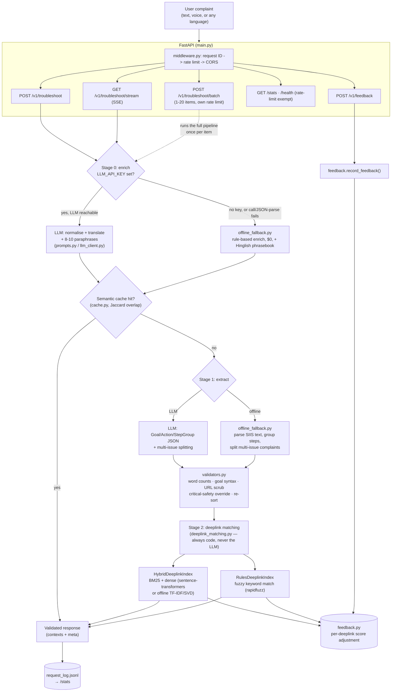

# Smart Guided Troubleshooting Engine

Samsung PRISM GenAI Hackathon 3rd Edition — Theme 2

Transforms a vague Galaxy device complaint ("screen flickers and battery dies
fast") into a validated, deeplink-mapped, one-tap troubleshooting plan.
Runs against the **real official Theme 2 dataset** (578 masked deeplinks,
20 official SIIS support queries) and ships with **two interchangeable
execution paths**:

| Path | Quality | Cost | Requires |
|---|---|---|---|
| **LLM path** (primary) | Best | Real $/token cost (or free on Groq) | `LLM_API_KEY` |
| **Offline fallback** (`offline_fallback.py`) | Good, fully deterministic | $0.00, always | Nothing |

The service picks the LLM path automatically when a key is configured, and
**falls back to the offline path automatically** — no crash, no manual
switch — whenever `LLM_API_KEY` isn't set, or an LLM call/JSON-parse fails
after retries. `meta.used_offline_fallback` in every response says which
path actually ran.

Beyond the core troubleshooting pipeline, the service also ships:

- **Confidence-gated escalation** (`escalation.py`) — a Goal the engine
  itself judged uncertain still returns its full plan, plus an honest
  caveat and a real backup action (`goal.escalation`).
- **Structured device-signal input** (`device_signals.py`) — optional
  battery/storage/uptime context reorders same-category actions toward
  what's actually relevant and adds a short advisory note; a no-op when
  omitted.
- **Session-scoped avoidance** (`session_memory.py`) — mark a deeplink
  unhelpful with a `session_id` and later requests in that same session
  steer away from re-suggesting it, without touching the global
  feedback-driven re-ranking.
- **Trending issues on `/stats`** (`request_log.py`) — a finer-grained
  "top recurring symptoms" breakdown (e.g. "Battery draining fast"), not
  just a 5-bucket domain count.
- **Shareable diagnostic reports** (`report.py`, `POST /v1/report`) —
  packages an already-computed result into a compact Markdown or
  self-contained HTML report a user can paste into a support ticket or
  forward to someone else.
- **Voice output** — `index.html`'s results panel can read the current
  plan aloud via the Web Speech API, alongside the existing voice *input*.
- **Physical-hazard safety short-circuit** (`safety.py`) — a swollen/
  bulging battery, smoke, sparking, or a burning/chemical smell is a real
  fire/burn risk, not a normal troubleshooting scenario. A narrow,
  deterministic keyword check runs before anything else (before Stage 0,
  before the cache) on both execution paths and, when it fires, replaces
  the plan entirely with a single "stop using, don't charge, contact
  Samsung Support" instruction — never software steps for this class of
  complaint. `meta.safety_alert` / `meta.safety_reason` flag it for any
  API/CLI/UI consumer; `index.html` renders an unmissable red banner.

**Contents:** [Architecture](#architecture) · [Setup](#setup) · [Run the pipeline directly](#run-the-pipeline-directly-no-server-needed-fastest-way-to-test) · [Run the API server](#run-the-api-server) · [Run the tests](#run-the-tests) · [Run with Docker](#run-with-docker) · [Try the demo UI](#try-the-demo-ui) · [Project structure](#project-structure) · [Production-readiness notes](#production-readiness-notes) · [Submission checklist](#submission-checklist-per-hackathon_guidelinespdf) · [Known limitations](#known-limitations)

## Architecture

Every request flows through the same four stages regardless of which
execution path runs Stage 0/1 — Stage 2 (deeplink matching) and every
validator run identically either way, so the LLM path and the offline
fallback can never disagree about the data *contract*, only about how
good the extracted troubleshooting content is.



**Why this shape:** Stage 2 and the validators are shared, not
duplicated, between the two Stage-0/1 paths — the ablation study and the
"no-hallucination" guarantee describe the code that actually ships, not a
separate demo-only code path. The feedback loop closes over the deeplink
matchers specifically (not the LLM/offline choice), because that's the
stage a human can meaningfully correct without needing to re-prompt an
LLM: "this deeplink was wrong" is a fact about the catalog match, not
about how the complaint was understood.

## Setup

```bash
python3 -m venv venv
source venv/bin/activate        # Windows: venv\Scripts\activate
pip install -r requirements.txt
cp .env.example .env            # optional — only needed for the LLM path
```

The service works with **zero setup beyond `pip install`** — without a
`.env`/`LLM_API_KEY` it just runs entirely on the offline fallback path.

**If you edit `.env` after the server is already running, you must fully
restart it (`Ctrl+C`, then re-run `uvicorn main:app --reload`).**
`--reload` only watches `.py` source files for changes, not `.env` —
`llm_client.py` reads `LLM_API_KEY`/`LLM_MODEL`/`LLM_PROVIDER` once at
import time, so a running process keeps using whatever `.env` said when
it first started until you restart it, even though the file on disk now
says something else. Also make sure `.env` actually sets `LLM_API_KEY`
(not `OPENAI_API_KEY` or `GROQ_API_KEY`) — that's the exact variable
name this project's code reads; setting a differently-named variable
can silently "work" (the `openai` Python SDK falls back to
`OPENAI_API_KEY` on its own if `LLM_API_KEY`/`api_key` comes through as
`None`) but leaves `LLM_MODEL` pointed at whatever stale default was
loaded at startup, which is a confusing failure mode to debug.

This includes a real person typing their **own** complaint with nothing
else supplied (no reference text to paste in) — e.g. `"my battery is
getting drained quickly"` on the offline path grounds itself in
`builtin_knowledge.py`, a small hand-written, explicitly-labeled
non-official Android/Samsung troubleshooting reference, then runs
through the exact same relevance-gating and Stage 2 deeplink-matching
code as every other query. `meta.used_builtin_reference` on the
response says whether a given plan came from that built-in text or a
real caller-supplied `siis_response`, so it's never ambiguous which one
grounded the answer. An out-of-scope complaint ("how do I cook pasta")
still correctly comes back `no_match` — see
`tests/test_builtin_knowledge.py`.

## Run the pipeline directly (no server needed, fastest way to test)

```bash
python pipeline.py
```

Runs the first 3 complaints from `sample_queries_real.json` (the real
official queries, each paired with its real SIIS reference text) through
the full pipeline and prints the JSON output.

## Run the API server

```bash
uvicorn main:app --reload --port 8000
```

Test it:
```bash
curl -X POST http://localhost:8000/v1/troubleshoot \
  -H "Content-Type: application/json" \
  -d '{"query": "screen flickers and the battery dies fast"}'

curl http://localhost:8000/health
curl http://localhost:8000/stats

# Live stage-by-stage progress (Server-Sent Events) -- what index.html's UI consumes:
curl -N "http://localhost:8000/v1/troubleshoot/stream?query=screen+flickers+and+battery+dies+fast"

# Thumbs up/down on a specific matched deeplink (drives adaptive re-ranking, see feedback.py):
curl -X POST http://localhost:8000/v1/feedback \
  -H "Content-Type: application/json" \
  -d '{"deeplink": "bixby://masked/act/...", "action_name": "Battery Settings", "helpful": true}'

# Batch: up to 20 complaints in one round trip (e.g. a device health-check
# screen probing several known symptoms at once). One item failing doesn't
# fail the others -- each result is reported individually as {"ok": ...}.
curl -X POST http://localhost:8000/v1/troubleshoot/batch \
  -H "Content-Type: application/json" \
  -d '{"items": [{"query": "battery drains fast"}, {"query": "screen flickers"}]}'

# Optional device context + session_id -- reorders relevant actions and adds
# an advisory note; session_id lets a later request in the same session
# avoid re-suggesting a deeplink marked unhelpful via POST /v1/feedback:
curl -X POST http://localhost:8000/v1/troubleshoot \
  -H "Content-Type: application/json" \
  -d '{"query": "battery drains fast", "device": {"battery_pct": 8}, "session_id": "demo-1"}'

# Package an already-computed result into a shareable Markdown/HTML report
# (never re-runs the pipeline -- see report.py):
curl -X POST http://localhost:8000/v1/report \
  -H "Content-Type: application/json" \
  -d '{"result": <the exact body /v1/troubleshoot returned>, "format": "markdown"}'
```

## Run the tests

```bash
pip install -r requirements.txt   # includes pytest / httpx (dev-only, see bottom of the file)
pytest                             # 330 tests, ~97% line coverage, runs in ~10s, no LLM key needed
pytest --cov=. --cov-report=term-missing   # optional, needs pytest-cov (already in requirements.txt)
```

Covers the data contract (`test_validators.py`, `test_schema.py`), the
zero-API-key offline path end-to-end against the real 20 official queries
(`test_offline_fallback.py`), retrieval against the real 578-entry catalog
plus the feedback-driven re-ranking (`test_deeplink_matching.py`,
`test_feedback.py`), the cache and stats logging (`test_cache.py`,
`test_request_log.py`), the full orchestration including a byte-for-byte
parity check between the streaming and non-streaming pipelines
(`test_pipeline.py`), and the live FastAPI service itself via `TestClient`
(`test_main.py`) — including the SSE endpoint. All isolated from your real
`cache_store.json` / `request_log.jsonl` / `feedback_*` files (see
`tests/conftest.py`).

## Terminal CLI

No browser, no server, no LLM key needed -- `cli.py` calls `pipeline.py`
directly and prints formatted results (drop `--api-base` to run against a
live server instead, which exercises the real HTTP contract: rate
limiting, request IDs, structured errors):

```bash
python cli.py query "battery drains fast and camera lags on open"
python cli.py query "screen flickers" --siis-file samples/screen.txt --verbose   # --verbose shows the matchExplanation breakdown
python cli.py stream "screen flickers and touch is laggy"                       # live stage-by-stage, same events the SSE endpoint emits
python cli.py batch sample_queries_real.json --out results.json                 # runs all 20 official queries, writes full results
python cli.py --api-base http://localhost:8000 batch queries.json               # same, but against a live server (uses POST /v1/troubleshoot/batch)
python cli.py --api-base http://localhost:8000 health
python cli.py --api-base http://localhost:8000 stats
python cli.py feedback bixby://masked/act/... "Wifi Settings" --unhelpful --session-id demo-1  # then re-run `query` with the same --session-id to see it steer away
python cli.py report "camera app keeps crashing" --format html -o report.html                  # package a result as a shareable report
```

Zero third-party dependencies for the `--api-base` HTTP calls (stdlib
`urllib`, not `requests`/`httpx`) -- the CLI works even in a minimal
install that skips the "dev / test only" section of `requirements.txt`.

## Run with Docker

```bash
docker build -t troubleshoot-engine .
docker run -p 8000:8000 troubleshoot-engine                       # offline mode
docker run -p 8000:8000 -e LLM_PROVIDER=groq -e LLM_API_KEY=xxx troubleshoot-engine  # LLM mode
```

## Try the demo UI

Open `index.html` directly in a browser (Chrome/Edge recommended — it
includes a **microphone button for voice input** via the Web Speech API,
and a language selector for both speech recognition and query language).
Point it at a running `uvicorn` server (`API_BASE` at the top of the
`<script>` block, defaults to `http://localhost:8000`). `demo.html` is a
simpler, earlier version of the same UI kept for reference.

A result's panel also offers an optional **device state** disclosure
(battery/storage/uptime, reorders relevant steps), **📋 copy report /
⬇ download report** buttons (packages the result via `POST /v1/report`),
and, on a browser that supports it, a **🔊 read steps aloud** control
(Web Speech API `SpeechSynthesis`, entirely client-side). A low-confidence
match also shows an amber **escalation banner** with a backup action, and
👍/👎 feedback on a matched deeplink is session-scoped — mark one
unhelpful and the *next* query in that same browser tab steers away from
suggesting it again.

Click **telemetry** in the top-right to open the **analytics dashboard**:
live stat tiles, a requests-by-domain bar chart, a **trending issues**
breakdown (the actual recurring symptoms, not just the domain bucket), and
a helpful/unhelpful feedback breakdown — all real numbers from `/stats`,
with hover tooltips and a screen-reader-friendly table view, not mock data.

## Project structure

| File | Purpose |
|---|---|
| `schema.py` | Pydantic models — exact data contract from the theme guide |
| `validators.py` | Programmatic checks (word counts, URL scrubbing, category ordering + safety-net re-sort) |
| `prompts.py` | LLM prompts (Stage 0 enrichment — now explicitly multi-language, Stage 1 extraction) |
| `llm_client.py` | Swappable LLM API wrapper (Anthropic / OpenAI / Groq) |
| `offline_fallback.py` | **Deterministic, zero-API-key replacement for Stages 0-1** — rule-based query enrichment + SIIS text parsing, $0 cost, no network |
| `deeplink_matching.py` | Shared Stage 2 deeplink retrieval (BM25 + dense hybrid, or pure fuzzy-rules fallback), used by both execution paths and the ablation study; also owns the session-avoidance ranking helper (see `session_memory.py`) |
| `escalation.py` | Shared confidence-gated escalation recommendation — attaches an honest caveat + real backup action to a low-confidence Goal without ever replacing the plan |
| `device_signals.py` | Optional device-state context (battery/storage/uptime) — reorders same-category actions toward what's relevant, adds an advisory note; a no-op when omitted |
| `session_memory.py` | Session-scoped avoidance: a deeplink marked unhelpful (with a `session_id`) is steered away from in that session's later requests — distinct from `feedback.py`'s global re-ranking |
| `safety.py` | Physical-hazard short-circuit (swollen battery, smoke, fire, sparks, chemical smell, burns) — narrow keyword-based detection that replaces the plan with a single "stop, don't charge, contact Samsung Support" Goal, on both execution paths, before Stage 0 or the cache ever runs |
| `report.py` | Packages an already-computed result into a shareable Markdown/HTML report (`POST /v1/report`) — a pure formatter, never re-runs the pipeline |
| `pipeline.py` | Orchestrates: complaint → enrich → extract → validate → deeplink match → cache, choosing LLM vs offline path per-request |
| `cache.py` | Fast-path semantic cache (keyword overlap) |
| `main.py` | FastAPI app: `POST /v1/troubleshoot(/batch)`, `GET /v1/troubleshoot/stream` (SSE), `POST /v1/feedback`, `POST /v1/report`, `GET /health`, `GET /stats` — warms the deeplink index at startup |
| `index.html` | Polished demo UI — voice input + output, language selector, device-state panel, shareable reports, live analytics dashboard with trending issues |
| `demo.html` | Simpler legacy demo UI |
| `deeplinks.json` | **Real official catalog**: 578 masked deeplinks across the full Settings surface |
| `siis_responses.json` | **Real official data**: 20 official SIIS support queries + their raw reference text |
| `sample_queries_real.json` | The 20 official queries adapted into this project's `{domain, complaint, siis_response}` shape — what `pipeline.py` and `eval/eval_harness.py` actually run against |
| `sample_queries.json` | Original placeholder queries (Battery/Camera/Display/Performance), kept for quick manual smoke tests only |
| `deeplinks_placeholder_backup.json`, `deeplinks_expanded_placeholder_backup.json` | Original placeholder catalogs, kept for reference |
| `official_theme2_data/` | Untouched copy of the official team-kit dataset (deeplinks.json, siis_responses.json, sample_output.json, schema_reference.py) |
| `eval/eval_harness.py` | Runs the full pipeline against the 20 real queries, produces `eval/metrics.md` |
| `eval/run_ablation.py` + `eval/matchers.py` | 3-variant deeplink-matching ablation (Full-LLM / Hybrid BM25+dense / Pure rules) against `eval/deeplink_ground_truth.json` (real catalog entries) |
| `eval/generate_results_jsonl.py` → `results.jsonl` | The offline results file the Theme 2 FAQ asks for alongside the live API: one JSON line per official query (`{"query", "query_variations", "response", "meta"}`), covering all 20/20. Each line is a direct serialization of `run_pipeline()`'s real output — never separately-derived — so it can't drift from what the live API actually returns for the same input. Re-run after any change that could affect the 20 official queries' output. |
| `request_log.py` | Per-request JSONL log, powers `/stats` |
| `feedback.py` | Human-in-the-loop feedback (`POST /v1/feedback`) + the bounded per-deeplink score adjustment that `deeplink_matching.py` consults on every search |
| `middleware.py` | Request IDs, structured `{"error": {...}}` bodies, and per-route in-memory rate limiting |
| `cli.py` | Terminal client (`query` / `stream` / `batch` / `feedback` / `report` / `health` / `stats`) -- runs the pipeline in-process by default, or against a live server with `--api-base` |
| `tests/` | pytest suite, ~97% line coverage, zero LLM key required — see "Run the tests" above |

## Production-readiness notes

Every response — success or error, including 429s — carries an
`X-Request-ID` header (echoed back if the caller supplies one, so a
client-side trace ID survives the round trip). Every error the service
returns, whatever raised it (a validation failure, an unknown route, a
rejected feedback submission, an uncaught exception), comes back in the
same shape:

```json
{"error": {"code": "400", "message": "...", "request_id": "..."}}
```

`/v1/troubleshoot` (and its `/stream` variant) and `/v1/feedback` are each
rate-limited per client IP (30 req/min and 60 req/min respectively — tuned
for interactive demo/judge traffic, not a load test); `/health` is exempt
so uptime checks never trip it. The limiter is in-process and in-memory,
which is the right call for this submission's actual deployment shape (a
single `uvicorn` process — see the Dockerfile, no orchestration implied
anywhere else in this repo) and is genuinely enforced, not just logged;
it just doesn't coordinate across multiple replicas, which a real
multi-instance deployment would need a shared store (e.g. Redis) for
instead. See `middleware.py` for all of this.

Every `actionableDeeplink` in a response (real match or the placeholder)
also carries a `matchExplanation` object — the score breakdown behind
*why* that specific screen was picked, not just that it was:

```json
"matchExplanation": {
  "matcher": "hybrid_bm25_dense",
  "dense_kind": "tfidf-svd-128 (offline fallback; sentence-transformers unavailable)",
  "alpha": 0.5,
  "bm25_component": 1.0,
  "dense_component": 0.8466,
  "combined_before_feedback": 0.9233,
  "feedback_adjustment": 0.0,
  "final_score": 0.9233,
  "threshold": 0.12,
  "matched_keywords": ["data", "fi", "mobile", "stable", "wi"]
}
```

The rules-variant matcher (`RulesDeeplinkIndex`) reports the analogous
`fuzzy_score` / `feedback_adjustment_pts` / `final_score_pts` shape
instead. This is genuine introspection into the actual ranking that ran
— not a post-hoc guess — so it's exactly as trustworthy as the match
itself, and it's the same code path `deeplink_matching.best_match()`
uses internally (`best_match_explained()` is a superset, verified in
`tests/test_deeplink_matching.py::TestMatchExplainability` to never
disagree with `best_match()` on which entry wins). `index.html` renders
it as a collapsed "why this match?" disclosure under each resolved
deeplink, with the overlapping keywords as chips.

## Submission checklist (per Hackathon_Guidelines.pdf)

- [x] Working prototype code, real official data wired in
- [x] README with reproducible setup + Docker
- [ ] Fill in `AI_Disclosure_Form_TEMPLATE.docx` as a team before submitting
- [ ] Demo video (max 5 min)
- [ ] Presentation file, named `CollegeName_TeamName_Submission_ppt`
- [ ] Push to a **public or shared GitHub repo**
- [ ] Tag the final commit `PRISM_GENAI_HACKATHON_Y2026` — the tagged commit is what gets judged
- [ ] Submit everything via the official Google Form by **25 Sep 2026, 11:59 PM**

## Known limitations

See `eval/metrics.md` section 6 ("Known Edge Cases & System Limitations")
for the full, honest list, generated from real measured runs — including
the offline fallback's narrow Hindi/Hinglish phrasebook (helps the
common code-mixed case, isn't general multi-language support -- the LLM
path is still the robust option for that), why this sandbox's ablation
numbers favor the rules-based matcher (HuggingFace Hub is unreachable
here, so the hybrid matcher runs on TF-IDF/SVD rather than real
sentence-transformer embeddings — re-run `eval/run_ablation.py` on a
machine with normal internet access to get the true comparison), and one
official query whose SIIS reference text is a genuine grounding mismatch
(floating "Assistive menu" circle, paired with Multi-Window/Edge-panel
docs) — the **offline fallback's keyword-overlap relevance gate is fooled
by it** (measured, not assumed: see metrics.md for why a stricter
threshold isn't a clean fix), while the **LLM path correctly rejects it**
via prompt rule #7's relevance judgment. This is the clearest concrete
example of why the LLM path is the primary path and the rule-based
fallback is a $0/always-available degrade, not a drop-in replacement.
